<h1>Consolidated Segmentation and Churn Analysis of Bank Clients</h1>

By: [Tamjid Ahsan](https://www.linkedin.com/in/tamjidahsan/) 

<br>

As capstone project of [Flatiron Data Science Bootcamp](https://flatironschool.com/campus-and-online-data-science-bootcamp/).
* Student pace: Full Time
* Scheduled project review date/time: July 22, 2021, 05:00 PM [DST]
* Instructor name: James Irving

## ABSTRACT
___
Attracting new customers is no longer a good strategy for mature businesses since the cost of retaining existing customers is much lower. For this reason, customer churn management becomes instrumental for any service industry.

This analysis is combining churn prediction and customer segmentation and aims to come up with an integrated customer analytics outline for churn management. There are six components in this analysis, starting with data pre-processing, exploratory data analysis, customer segmentation, customer characteristics analytics, churn prediction, and factor analysis. This analysis is adapting OESMiN framework for data science.

Customer data of a bank is used for this analysis. After preprocessing and exploratory data analysis, customer segmentation is carried out using K-means clustering. A Random Forest model is used focusing on optimizing f-1 score to validate the clustering and get feature importance. By using this model, customers are segmented into different groups, which sanctions marketers and decision makers to implement existing customer retention strategies more precisely.  Then different machine learning models are used with the preprocessed data along with the segmentation prediction from the K-means clustering model. For this type of modeling, models were optimized for precision. To address class imbalance Synthetic Minority Oversampling Technique (SMOTE) is applied to the training set. For factor analysis feature importance of models are used.
Based on cluster characteristics, clients are labeled as `Low value frequent users of services`, `High risk clients`, `Regular clients`, `Most loyal clients`, and `High value clients`. Final model accuracy is 0.97 with good precision of predicting churn at around 0.93.


## OVERVIEW
___
<br>

<br>

Customer churn is a big issue that occurs when consumers abandon your products and go to another provider. Because of the direct impact on profit margins, firms are now focusing on identifying consumers who are at danger of churning and keeping them through tailored promotional offers. Customer churn analysis and customer turnover rates are frequently used as essential business indicators by banks, insurance firms, streaming service providers, and telecommunications service providers since the cost of maintaining existing customers is significantly less than the cost of obtaining a new one.

When it comes to customers, the financial crisis of 2008 changed the banking sector's strategy. Prior to the financial crisis, banks were mostly focused on acquiring more and more clients. However, once the market crashed after the market imploded, banks realized rapidly that the expense of attracting new clients is multiple times higher than holding existing ones, which means losing clients can be monetarily unfavorable. Fast forward to today, and the global banking sector has a market capitalization of $7.6 trillion, with technology and laws making things easier than ever to transfer assets and money between institutions. Furthermore, it has given rise to new forms of competition for banks, such as open banking, neo-banks, and fin-tech businesses (Banking as a Service (BaaS))<sup>[1]</sup>. Overall, today's consumers have more options than ever before, making it easier than ever to transfer or quit banks altogether. According to studies, repeat customers seem to be more likely to spend 67 percent more on a bank's products and services, emphasizing the necessity of knowing why clients churn and how it varies across different characteristics. Banking is one of those conventional sectors that has undergone continuous development throughout the years. Nonetheless, many banks today with a sizable client base expecting to gain a competitive advantage have not tapped into the huge amounts of data they have, particularly in tackling one of the most well-known challenges, customer turnover.

Churn can be expressed as a level of customer inactivity or disengagement seen over a specific period. This expresses itself in the data in a variety of ways e.g., frequent balance transfers to another account or unusual drop in average balance over time. But how can anyone look for churn indicators? Collecting detailed feedback on the customer's experience might be difficult. For one thing, surveys are both rare and costly. Furthermore, not all clients receive it, or bother to reply to it. So, where else can you look for indicators of future client dissatisfaction? The solution consists in identifying early warning indicators from existing data. Advanced machine learning and data science techniques can learn from previous customer behavior and external events that lead to churn and use this knowledge to anticipate the possibility of a churn-like event in the future.

___

Ref:

[1] [Business Insider](https://www.businessinsider.com/banking-industry-trends)

[2] Stock images from [PEXELS](https://www.pexels.com/)


## BUSINESS PROBLEM
___
<br>

While everyone recognizes the importance of maintaining existing customers and therefore improving their lifetime value, there is very little banks can do about customer churn when they don't anticipate it coming in the first place. Predicting attrition becomes critical in this situation, especially when unambiguous consumer feedback is lacking. Precise prediction enables advertisers and client experience groups to be imaginative and proactive in their offering to the client.

XYZ Bank (read: fictional) is a mature financial institution based in Eastern North America. Recent advance in technology and rise in BaaS is a real threat for them as they can lure away the existing clientele. The bank has existing data of their clients. Based on the data available, the bank wants to know whom of them are in risk of churning. 

This analysis focuses on the behavior of bank clients who are more likely to leave the bank (<strong>i.e. close their bank account</strong>, churn).

# OBTAIN

The data for this analysis is obtained from <i>Kaggle</i>, titled <b>"Credit Card customers"</b> uploaded by Sakshi Goyal. Which can be found [here](https://www.kaggle.com/sakshigoyal7/credit-card-customers), this dataset was originally obtained from [LEAPS Analyttica](https://leaps.analyttica.com/sample_cases/11). A copy of the data is in this repository at `/data/BankChurners.csv`.

This dataset contains data of more than 10000 credit card accounts with around 19 variables of different types as of a time point and their attrition indicator over the next 6 months. 

Data description is as below:

| Variable | Type | Description |
|:---:|:---:|:---:|
| Clientnum | Num | Client number. Unique identifier for the customer holding the account |
| Attrition_Flag | obj | Internal event (customer activity) variable - if the account is closed then 1 else 0 |
| Customer_Age | Num | Demographic variable - Customer's Age in Years |
| Gender | obj | Demographic variable - M=Male, F=Female |
| Dependent_count | Num | Demographic variable - Number of dependents |
| Education_Level | obj | Demographic variable - Educational Qualification of the account holder (example: high school, college graduate, etc.) |
| Marital_Status | obj | Demographic variable - Married, Single, Divorced, Unknown |
| Income_Category | obj | Demographic variable - Annual Income Category of the account holder (< $40K, $40K - 60K, $60K - $80K, $80K-$120K, > $120K, Unknown) |
| Card_Category | obj | Product Variable - Type of Card (Blue, Silver, Gold, Platinum) |
| Months_on_book | Num | Months on book (Time of Relationship) |
| Total_Relationship_Count | Num | Total no. of products held by the customer |
| Months_Inactive_12_mon | Num | No. of months inactive in the last 12 months |
| Contacts_Count_12_mon | Num | No. of Contacts in the last 12 months |
| Credit_Limit | Num | Credit Limit on the Credit Card |
| Total_Revolving_Bal | Num | Total Revolving Balance on the Credit Card |
| Avg_Open_To_Buy | Num | Open to Buy Credit Line (Average of last 12 months) |
| Total_Amt_Chng_Q4_Q1 | Num | Change in Transaction Amount (Q4 over Q1)  |
| Total_Trans_Amt | Num | Total Transaction Amount (Last 12 months) |
| Total_Trans_Ct | Num | Total Transaction Count (Last 12 months) |
| Total_Ct_Chng_Q4_Q1 | Num | Change in Transaction Count (Q4 over Q1)  |
| Avg_Utilization_Ratio | Num | Average Card Utilization Ratio |

There are unknown category in Education Level, Marital Status, and Income Category. Imputing values for those features does not make sense. And it is understandable why those are unknown in the first place. Information about Education and Marital status is often complicated and confidential; and customers are reluctant to share those information. Same for the income level. It is best for the model to be able to handle when those information is not available and still produce prediction.

Because of this reason those are not imputed in any way for this analysis.


    "df" statistical description: 
    ++++++++++++++++++++++++++++++
    
<table border="1" class="dataframe">
  <thead>
    <tr style="text-align: right;">
      <th></th>
      <th>count</th>
      <th>unique</th>
      <th>top</th>
      <th>freq</th>
      <th>mean</th>
      <th>std</th>
      <th>min</th>
      <th>25%</th>
      <th>50%</th>
      <th>75%</th>
      <th>max</th>
      <th>dtype</th>
      <th>nulls</th>
    </tr>
  </thead>
  <tbody>
    <tr>
      <th>Attrition_Flag</th>
      <td>10127.0</td>
      <td>2</td>
      <td>Existing Customer</td>
      <td>8500</td>
      <td></td>
      <td></td>
      <td></td>
      <td></td>
      <td></td>
      <td></td>
      <td></td>
      <td>object</td>
      <td>0</td>
    </tr>
    <tr>
      <th>Customer_Age</th>
      <td>10127.0</td>
      <td></td>
      <td></td>
      <td></td>
      <td>46.33</td>
      <td>8.02</td>
      <td>26.0</td>
      <td>41.0</td>
      <td>46.0</td>
      <td>52.0</td>
      <td>73.0</td>
      <td>int64</td>
      <td>0</td>
    </tr>
    <tr>
      <th>Gender</th>
      <td>10127.0</td>
      <td>2</td>
      <td>F</td>
      <td>5358</td>
      <td></td>
      <td></td>
      <td></td>
      <td></td>
      <td></td>
      <td></td>
      <td></td>
      <td>object</td>
      <td>0</td>
    </tr>
    <tr>
      <th>Dependent_count</th>
      <td>10127.0</td>
      <td></td>
      <td></td>
      <td></td>
      <td>2.35</td>
      <td>1.3</td>
      <td>0.0</td>
      <td>1.0</td>
      <td>2.0</td>
      <td>3.0</td>
      <td>5.0</td>
      <td>int64</td>
      <td>0</td>
    </tr>
    <tr>
      <th>Education_Level</th>
      <td>10127.0</td>
      <td>7</td>
      <td>Graduate</td>
      <td>3128</td>
      <td></td>
      <td></td>
      <td></td>
      <td></td>
      <td></td>
      <td></td>
      <td></td>
      <td>object</td>
      <td>0</td>
    </tr>
    <tr>
      <th>Marital_Status</th>
      <td>10127.0</td>
      <td>4</td>
      <td>Married</td>
      <td>4687</td>
      <td></td>
      <td></td>
      <td></td>
      <td></td>
      <td></td>
      <td></td>
      <td></td>
      <td>object</td>
      <td>0</td>
    </tr>
    <tr>
      <th>Income_Category</th>
      <td>10127.0</td>
      <td>6</td>
      <td>Less_than_40K</td>
      <td>3561</td>
      <td></td>
      <td></td>
      <td></td>
      <td></td>
      <td></td>
      <td></td>
      <td></td>
      <td>object</td>
      <td>0</td>
    </tr>
    <tr>
      <th>Card_Category</th>
      <td>10127.0</td>
      <td>4</td>
      <td>Blue</td>
      <td>9436</td>
      <td></td>
      <td></td>
      <td></td>
      <td></td>
      <td></td>
      <td></td>
      <td></td>
      <td>object</td>
      <td>0</td>
    </tr>
    <tr>
      <th>Months_on_book</th>
      <td>10127.0</td>
      <td></td>
      <td></td>
      <td></td>
      <td>35.93</td>
      <td>7.99</td>
      <td>13.0</td>
      <td>31.0</td>
      <td>36.0</td>
      <td>40.0</td>
      <td>56.0</td>
      <td>int64</td>
      <td>0</td>
    </tr>
    <tr>
      <th>Total_Relationship_Count</th>
      <td>10127.0</td>
      <td></td>
      <td></td>
      <td></td>
      <td>3.81</td>
      <td>1.55</td>
      <td>1.0</td>
      <td>3.0</td>
      <td>4.0</td>
      <td>5.0</td>
      <td>6.0</td>
      <td>int64</td>
      <td>0</td>
    </tr>
    <tr>
      <th>Months_Inactive_12_mon</th>
      <td>10127.0</td>
      <td></td>
      <td></td>
      <td></td>
      <td>2.34</td>
      <td>1.01</td>
      <td>0.0</td>
      <td>2.0</td>
      <td>2.0</td>
      <td>3.0</td>
      <td>6.0</td>
      <td>int64</td>
      <td>0</td>
    </tr>
    <tr>
      <th>Contacts_Count_12_mon</th>
      <td>10127.0</td>
      <td></td>
      <td></td>
      <td></td>
      <td>2.46</td>
      <td>1.11</td>
      <td>0.0</td>
      <td>2.0</td>
      <td>2.0</td>
      <td>3.0</td>
      <td>6.0</td>
      <td>int64</td>
      <td>0</td>
    </tr>
    <tr>
      <th>Credit_Limit</th>
      <td>10127.0</td>
      <td></td>
      <td></td>
      <td></td>
      <td>8631.95</td>
      <td>9088.78</td>
      <td>1438.3</td>
      <td>2555.0</td>
      <td>4549.0</td>
      <td>11067.5</td>
      <td>34516.0</td>
      <td>float64</td>
      <td>0</td>
    </tr>
    <tr>
      <th>Total_Revolving_Bal</th>
      <td>10127.0</td>
      <td></td>
      <td></td>
      <td></td>
      <td>1162.81</td>
      <td>814.99</td>
      <td>0.0</td>
      <td>359.0</td>
      <td>1276.0</td>
      <td>1784.0</td>
      <td>2517.0</td>
      <td>int64</td>
      <td>0</td>
    </tr>
    <tr>
      <th>Avg_Open_To_Buy</th>
      <td>10127.0</td>
      <td></td>
      <td></td>
      <td></td>
      <td>7469.14</td>
      <td>9090.69</td>
      <td>3.0</td>
      <td>1324.5</td>
      <td>3474.0</td>
      <td>9859.0</td>
      <td>34516.0</td>
      <td>float64</td>
      <td>0</td>
    </tr>
    <tr>
      <th>Total_Amt_Chng_Q4_Q1</th>
      <td>10127.0</td>
      <td></td>
      <td></td>
      <td></td>
      <td>0.76</td>
      <td>0.22</td>
      <td>0.0</td>
      <td>0.63</td>
      <td>0.74</td>
      <td>0.86</td>
      <td>3.4</td>
      <td>float64</td>
      <td>0</td>
    </tr>
    <tr>
      <th>Total_Trans_Amt</th>
      <td>10127.0</td>
      <td></td>
      <td></td>
      <td></td>
      <td>4404.09</td>
      <td>3397.13</td>
      <td>510.0</td>
      <td>2155.5</td>
      <td>3899.0</td>
      <td>4741.0</td>
      <td>18484.0</td>
      <td>int64</td>
      <td>0</td>
    </tr>
    <tr>
      <th>Total_Trans_Ct</th>
      <td>10127.0</td>
      <td></td>
      <td></td>
      <td></td>
      <td>64.86</td>
      <td>23.47</td>
      <td>10.0</td>
      <td>45.0</td>
      <td>67.0</td>
      <td>81.0</td>
      <td>139.0</td>
      <td>int64</td>
      <td>0</td>
    </tr>
    <tr>
      <th>Total_Ct_Chng_Q4_Q1</th>
      <td>10127.0</td>
      <td></td>
      <td></td>
      <td></td>
      <td>0.71</td>
      <td>0.24</td>
      <td>0.0</td>
      <td>0.58</td>
      <td>0.7</td>
      <td>0.82</td>
      <td>3.71</td>
      <td>float64</td>
      <td>0</td>
    </tr>
    <tr>
      <th>Avg_Utilization_Ratio</th>
      <td>10127.0</td>
      <td></td>
      <td></td>
      <td></td>
      <td>0.27</td>
      <td>0.28</td>
      <td>0.0</td>
      <td>0.02</td>
      <td>0.18</td>
      <td>0.5</td>
      <td>1.0</td>
      <td>float64</td>
      <td>0</td>
    </tr>
  </tbody>
</table>
</div>

    

No null values to deal with. Features have the correct data type. No unknown category is spotted, and statistics does not warrant any closer inspection. 

# EDA


    
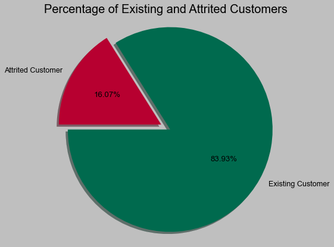
    


 In this dataset, around 16% clients has halted their affiliation with the bank.


    
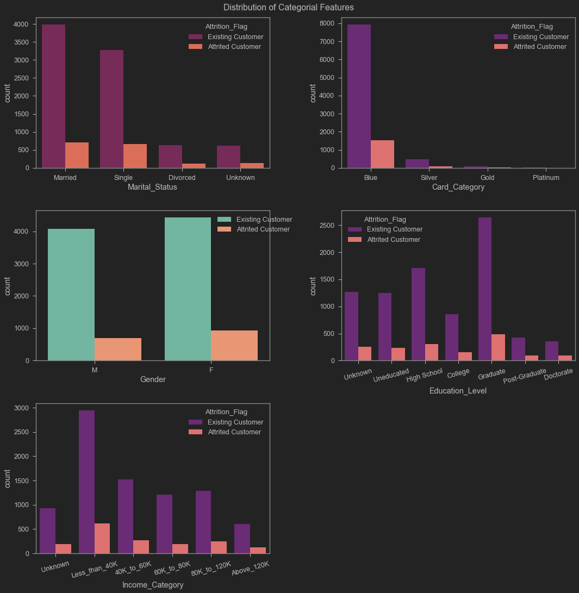
    


| Category | Observation |
|---|:---:|
|  Marital Status  | Being married or single has little impact on them churning |
|  Card Category  | Blue category severely out weighs the other card categories |
|  Gender  | Slightly more female clients than men, overall almost similar churning possibility |
|  Education Level  | Most of the clients of the bank are graduate, given the size of each class, churn rate is very similar |
|  Income Category  | Most of the clients earn less than 40K. |


    
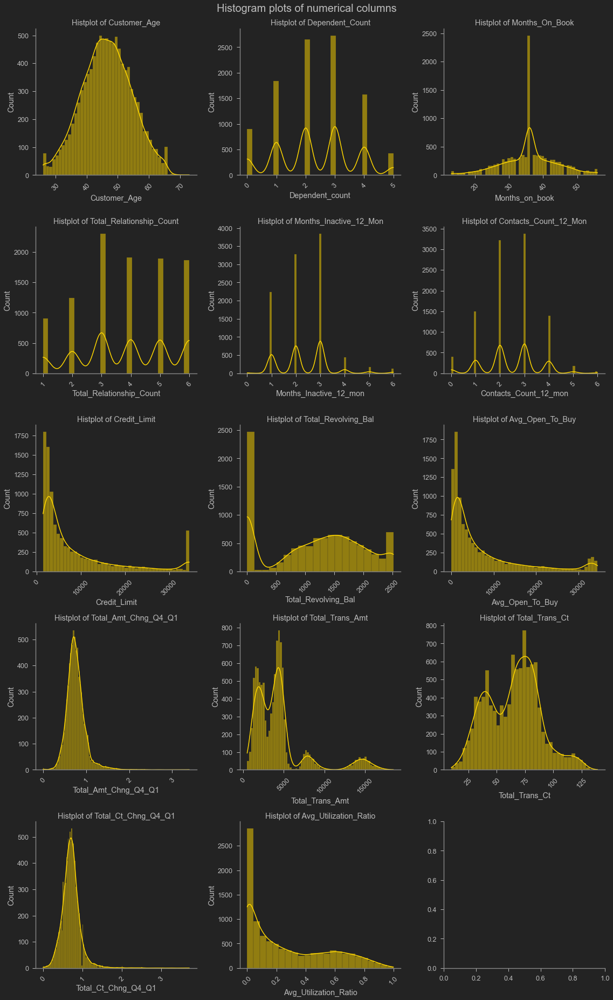
    


Most of them are not normally distributed. Using logistic regression might not be the best performing model for this analysis. As it fail to meet linearity assumption most of the time. For this feature transformation will be required.

<br>

| Feature | Observation |
|---|:---:|
|  Customer Age  | Normal distribution for age |
|  Dependent count  | ordinal   variable ranging one to five|
|  Months on book  | Almost normal distribution except a huge   spike at 36 moth point and a gap at every 6 month interval |
|  Total Relationship Count  | ordinal   variable, majority of clients have 3 or more relationship |
|  Months_Inactive_12_mon  | most customers don’t stay inactive more   than 3 months |
|  Contacts_Count_12_mon  | ordinal   variable, most values in 2 and 3 |
|  Credit Limit  | Almost log normal distribution, maximum   credit limit offered is 35k. |
|  Total Revolving Bal  | ignoring   a spike of 0, this distribution has almost normal distribution, with a fat   tail at the right end |
|  Avg Open To Buy  | log normal distribution |
|  Total_Amt_Chng_Q4_Q1  | normal   distribution with skinny ling tail towards right |
|  Total Trans Amt  | seems like there are four normal   distribution here, this can be a strong deciding feature for use in   segmentation |
|  Total Trans Ct  | normal   distribution with skinny ling tail towards right |
|  Total_Ct_Chng_Q4_Q1  | good distribution but far from being   normal distribution |
|  Avg Utilization Ratio  | Log   normal distribution, a very few people are using their total credit limit.   This expected as very few people does so. |

## Label encoding

Labels are encoded
```python
# ML friendly labels
churn_map = {'Existing Customer':0, 'Attrited Customer':1}

X = df.drop(columns='Attrition_Flag').copy()
y = df.Attrition_Flag.map(churn_map).copy()
```

Then data is train-test splitted, scaled and one-hot-encoded, and oversampled to have around 13K samples for training prediction model.

# MODEL

## Segmentation

Several k-means models were used to deduce optimal number of segmentation. Number of cluster size used ranged from 1 to 20.


    
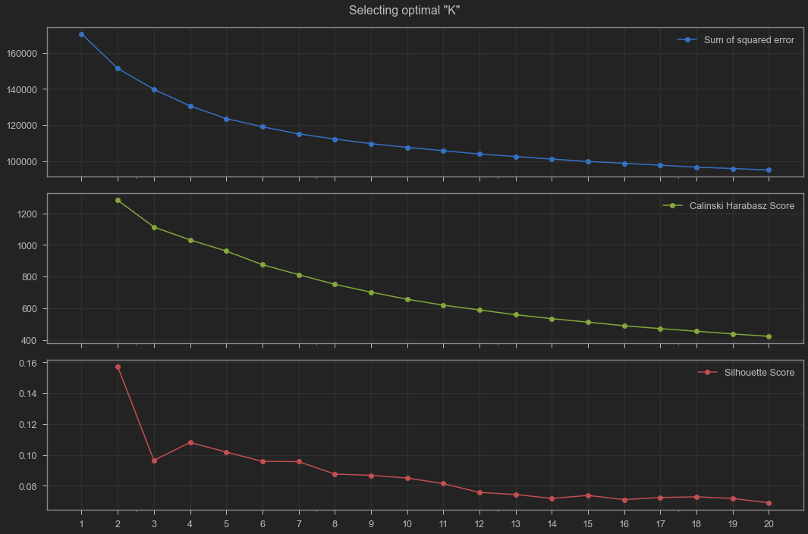
    


Higher Silhouette Coefficient score relates to a model with better defined clusters. And higher Calinski-Harabasz score relates to a model with better defined clusters.

Although by looking at the visual no obvious optimal K can not be spotted.  Based on the `Silhouette Score` and `Sum of squared error` (a.k.a. Elbow plot), 5 segmentation seemed optimal for initial model. `Calinski Harabasz Score` also supports this segmentation. 

Customers are segmented by 5 groups by their characteristics. 

There is a clear separation between clusters in a two dimensional space using PCA.


    
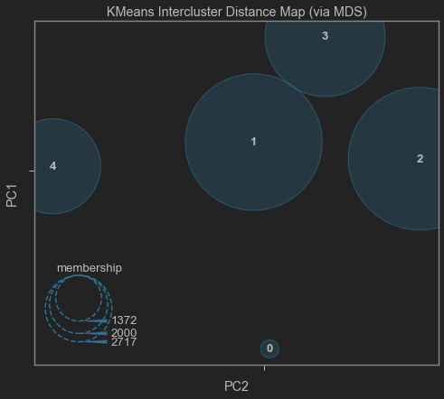
    


### Feature importance

A Random Forest model is used to get feature importance alongside a permutation importance analysis to get the most important features.


<strong>Report of RandomForestClassifier type model using train-test split dataset.</strong>


    ******************************************************************************************
    Train accuracy score: 0.9809
    Test accuracy score: 0.9319
        No over or underfitting detected, diffrence of scores did not cross 5% thresh hold.
    ******************************************************************************************
    
    Test Report: 
    ************************************************************
                  precision    recall  f1-score   support
    
               0       0.90      0.98      0.94       187
               1       0.96      0.92      0.94       572
               2       0.94      0.91      0.92       600
               3       0.89      0.92      0.91       395
               4       0.94      0.99      0.96       272
    
        accuracy                           0.93      2026
       macro avg       0.93      0.94      0.93      2026
    weighted avg       0.93      0.93      0.93      2026
    
    ************************************************************
    


    
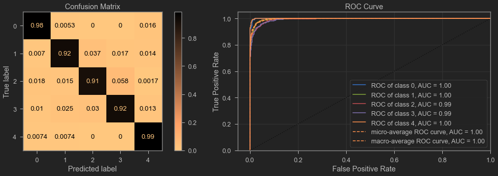
    


Model fit is good with good performance metrics and no sign of overfitting. Prediction precision is over .90 for most of the classes expect cluster 3, which differs from model run to run based on train-test split, still close to .90 most of the time.

Then feature importance and permutation importance is used to get a view of most important features.


    
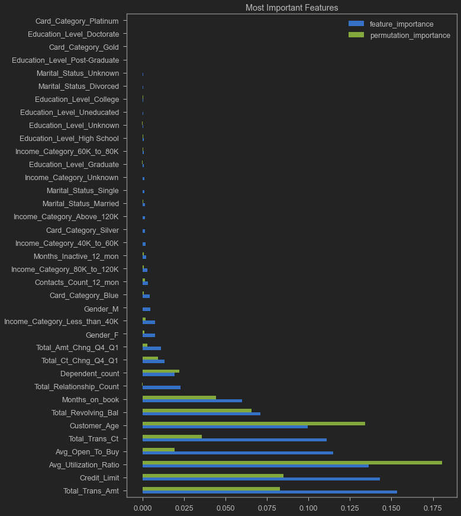
    


By looking at the above chart, these 10 features are selected as the most important features. 

    ['Total_Trans_Amt',
     'Credit_Limit',
     'Avg_Utilization_Ratio',
     'Avg_Open_To_Buy',
     'Total_Trans_Ct',
     'Customer_Age',
     'Total_Revolving_Bal',
     'Months_on_book',
     'Total_Relationship_Count',
     'Dependent_count']


## Segmentation Characteristics

### Cluster Distribution


    
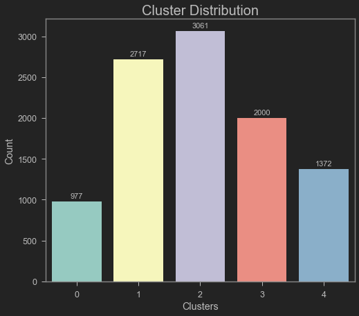
    


Cluster 0 has the lowest member. Cluster 1 and 2 are fairly similar sized. Cluster 3 and 4 have moderate members.

### Summary of exploring clusters by the most important features.

<br>

|  Variable  | Cluster 0 | Cluster 1 | Cluster 2 | Cluster 3 | Cluster 4 | Churn | Comment |  Description  |
|---|---|---|---|---|---|---|---|---|
|  Avg_Open_To_Buy  | spread | low | low | low | high value | 1 | Majority values   are low |  Open to Buy Credit Line (Average of last 12   months)  |
|  Avg_Utilization_Ratio  | low utilization | minimal low utilization | no low utilization ratio | med utilization | low utilization | 1 | Majority values are low |  Average Card Utilization Ratio  |
|  Card_Category  |  |  |  |  |  | 1 | High class   imbalance to comment | Type   of Card (Blue, Silver, Gold, Platinum)  |
|  Contacts_Count_12_mon  |  |  |  |  |  | 1 | 3 |  No. of Contacts in the last 12 months  |
|  Credit_Limit  | all clients   from2k  | mostly low   limit | 2k to 4k, no   high limit |  | high limit,   above 14k | 1 |  |  Credit Limit on the Credit Card  |
|  Customer_Age  | similar | similar | similar | older | similar | 3 |  | Customer's Age in Years  |
|  Dependent_count  | spread | spread | spread | low | spread | 1 | count 3 and 4   is risky |  Number of dependents  |
|  Education_Level  | Graduate | Graduate | College | College | Uneducated | 1 | Graduates >HS >= Unknown>=Uneducated, PG and PhD   is less likely | Educational Qualification of the account   holder (example: high school, college graduate, etc.)  |
|  Gender  | M | F | F | F | M | 1 | Females is   risky | M=Male,   F=Female  |
|  Income_Category  | Less_than_40K | 40K_to_60K | 40K_to_60K | Less_than_40K | Unknown | 1 | Less than 40K | Annual Income Category of the account   holder (< $40K, $40K - 60K, $60K - $80K, $80K-$120K, > $120K,   Unknown)  |
|  Marital_Status  | Unknown | Single | Married | Married | Unknown | 1 | Majority values   is Married | Married,   Single, Unknown , Divorced |
|  Months_Inactive_12_mon  |  |  |  |  |  | 1 | 3 |  No. of months inactive in the last 12   months  |
|  Months_on_book  | good | similar | similar | loyal customer | similar | 3 |  | Time   of Relationship |
|  Total_Amt_Chng_Q4_Q1  |  |  |  |  |  | 1 | High frequency if transaction |  Change in Transaction Amount (Q4 over   Q1)   |
|  Total_Ct_Chng_Q4_Q1  |  |  |  |  |  | 1 |  |  Change in Transaction Count (Q4 over   Q1)   |
|  Total_Relationship_Count  | low | high | high | high | high | 1 | 2 and 3 are most   frequent |  Total no. of products held by the   customer  |
|  Total_Revolving_Bal  | spread | low | mod | spread | spread | 1 | Majority values   are low |  Total Revolving Balance on the Credit   Card  |
|  Total_Trans_Amt  | High transaction amount | low | mid amount till 5k high feq transaction | mid amount till 5k high feq transaction | mid amount till 5k med feq transaction | 1 | low amounts |  Total Transaction Amount (Last 12   months)  |
|  Total_Trans_Ct  | heavy user | moderate user | moderate user | moderate user | moderate user | 1 | Majority values   are between 30 to 50 |  Total Transaction Count (Last 12   months)  |

## Prediction

### Best model

After experimenting with logistic regression and Random Forest model, `XGBClassifier` type model deemed the best model type for predicting churning. It shows best fit and model performance. Here is the model report for that model.


<strong>Report of XGBClassifier type model using train-test split dataset.</strong>


    ******************************************************************************************
    Train accuracy score: 1.0
    Test accuracy score: 0.9753
        No over or underfitting detected, diffrence of scores did not cross 5% thresh hold.
    ******************************************************************************************
    
    Test Report: 
    ************************************************************
                  precision    recall  f1-score   support
    
               0       0.98      0.99      0.99      1693
               1       0.93      0.92      0.92       333
    
        accuracy                           0.98      2026
       macro avg       0.96      0.95      0.95      2026
    weighted avg       0.98      0.98      0.98      2026
    
    ************************************************************
    


    
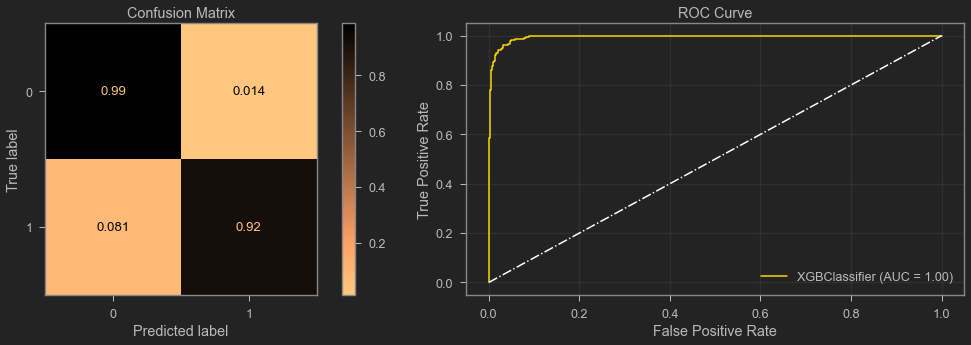
    


# INTERPRET 

## Customer Segmentation model

Based on analysis from the segmentation part and exploration of the clusters, they can be be identified as following:

- Cluster 0: Low value frequent users of services.
- Cluster 1: High risk clients segmentation.
- Cluster 2: Regular clients.
- Cluster 3: Most loyal clients. (mostly consists of older clients)
- Cluster 4: High value clients.

## Churn Prediction model

Using SHAPely values to explain this model. SHAP (SHapley Additive exPlanations) is a game-theoretic approach to explain the output of any machine learning model. [(source)](https://github.com/slundberg/shap)


Features are sorted by the sum of SHAP value magnitudes over all samples. It also shows the distribution of the impacts each feature has. The color represents the feature value:

- red indicating high 
- blue indicating low.

Here high represents category 1 (Client Churn). 

    
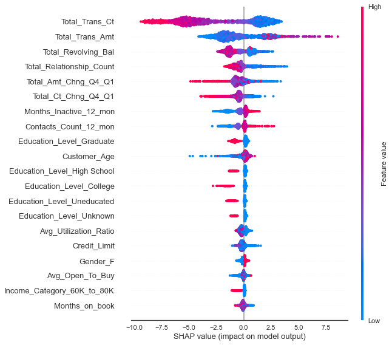
    


| Feature | Observation |
|---|---|
|  Total_Trans_Ct  | Low   value means higher risk of churning |
|  Total_Trans_Amt  | Above agerage value means higher risk of   churning |
|  Total_Revolving_Bal  | Low   value means higher risk of churning |
|  Total_Relationship_Count  | More relationship indicates more  chance of churning |
|  Total_Amt_Chng_Q4_Q1  | Low   value means higher risk of churning |
|  Total_Ct_Chng_Q4_Q1  | Low value means higher risk of churning |
|  Months_Inactive_12_mon  | Higher   value means higher risk of churning |
|  Contacts_Count_12_mon  | Higher value means higher risk of   churning |

And so on.

# RECOMMENDATION & CONCLUSION

Cluster 1 is the most riskiest client segmentation. They should be offered deals to make them stick with the bank.
- Their utilization ratio is low. By offering incentives like cash back offer is a viable option.
- Their credit limits are low. Based on their credit habit, they can be offered a larger credit limit.
<br>

As a rule of thumb:
- Most loyal and at risk clients are female. Marketers should target them with specific package.
- frequent smaller amount of transaction can be perceived as a red flag. When spotted, customer relationship team must act on it.
- large expenditure can be a signal for cross selling products and it is also a sign of churn.

This churn prediction model can be valuable for marketers to identify clients with higher risk of churning. This is invaluable for marketers to be able to identify potential customers as well as customers who are on verge of leaving for any reason. Simply by identifying and reaching out to them can reduce customer dissatisfaction and can retain a substantial portion of them. 


# DASHBOARD

## Online
COMING SOON
## Local
run `viz_dash.py` for dashboard with insight and prediction. `Dashboard_jupyter.ipynb` contains JupyterDash version for running dash inside jupyter notebook.

Snapshot:
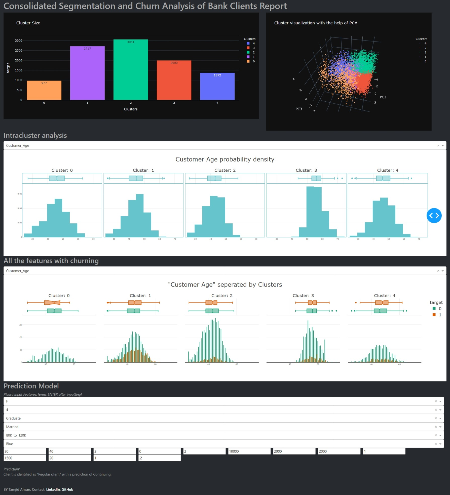

# ENVIRONMENT SETUP

For running this locally please follow instructions from `'./assets/req/README.md'`.

# REPOSITORY STRUCTURE

```
├── LICENSE
├── README.md                                         # top level readme
├── additional_notebooks
│   ├── analysis_old.ipynb
│   ├── analysis.html                                 # notebook html
│   ├── analysis.pdf                                  # notebook pdf
│   └── dashboard_using_JupyterDash.ipynb             # jupyter notebook used for JupyterDash
├── analysis.ipynb                                    # jupyter notebook used for analysis
├── assets                                           
│   ├── req                                           # env readme with instructions 
│   │   ├── README.md
│   │   ├── env_files                                 # env files
│   │   │   ├── learn-env-win.yml
│   │   │   └── learn-env.yml
│   │   └── package_and_lib
│   │       ├── requirements_conda.txt
│   │       └── requirements_pip.txt
│   └── ...
├── data                                              # saved model
│   ├── BankChurners.csv                              # raw data
│   ├── scaled_data.csv
│   └── unscaled_data.csv
├── imports_and_functions
│   ├── experimental.py
│   ├── functions.py                                  # functions used for analysis
│   └── packages.py
├── model
│   ├── best_model_parameters_xgb.joblib
│   ├── cate_col.joblib
│   ├── kmeans_segmentation_model.joblib
│   ├── nume_col.joblib
│   ├── preprocessor.joblib
│   ├── scaled_data.joblib
│   ├── unscaled_data.joblib
│   ├── viz_dash.py
│   └── xgb_clf_churn_prediction_all_data.joblib
├── presentation.pdf                                      # presentation pdf
├── presentation.pptx                                     # presentation
└── viz_dash.py                                           # plotly dash py file
```
For additional info contact [me](https://www.linkedin.com/in/tamjidahsan/)  via linkdin.